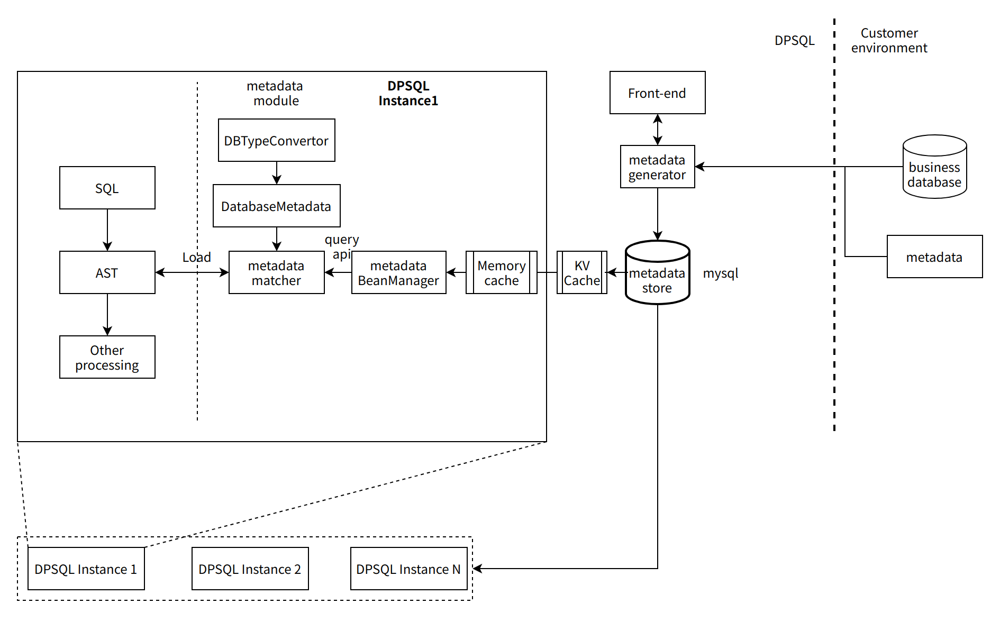

Metadata management design
=======

Background
-------------
In DPSQL system, it is necessary to extract metadata information for SQL rewriting and sensitivity analysis.

Target
-------------
- Persistent storage metadata
- Increasing caching for metadata queries for frequently used tables, improving dynamic read performance overhead
- Providing metadata information CRUD API
- Supports automatic extraction of metadata information

Overall design
-------------

- Overall architecture description
  - Metadata generator, Metadata information generator, given the data source configuration information and table name, automatically extract the Metadata information of the table and store it in the metadata store
  - Metadata store, centralized storage
  - Set up a meta matcher object, each query is created independently, responsible for matching the corresponding meta information from the metadata store according to prefix, db, table, column and other information; different data sources correspond to different metamatchers to handle differences
  - Metadata information mainly includes: database name, table name, column name, column data type, map type column key, value type, numerical type, maximum value, minimum value and other information
  - Querying and loading metadata through Mysql is a very big bottleneck when executing queries, so two layers of caching, in-memory caching and kv -based caching were added before Mysql.

- About database type conversion
  - DPSQL uses python implementation, for the basic data types are only distinguished to (int, float, string, datatime), but the basic data types of the database is relatively rich, such as clickhouse , int has int32/int64/uint32/uin64, etc.; in addition, built-in function return type, arithmetic operation type derivation problem.
  - DB type converter module, when loading metadata information from the metadata store, assist it to convert the database type name to the type name of DPSQL internal processing (such as uint32 - > int); AST Obtain dbtype converter from the database metadata object, and obtain database-related results when doing type derivation.

