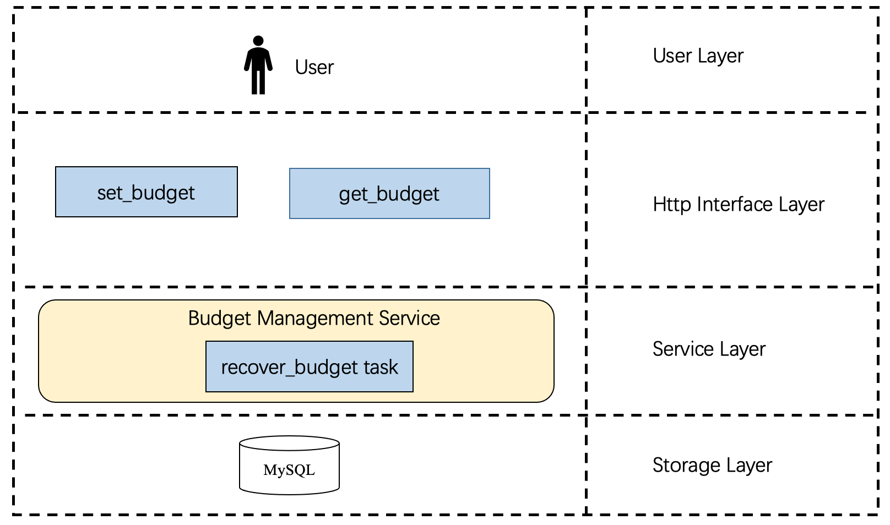

# Budget Management Design

## Background
In order to meet the needs of users to manage the privacy budget of datasets, configure SQL queries' privacy budget, it is necessary to develop the budget management service.

## Goals
Finish the development of the following functions:
- Management of table budget information (including set and get)
- Privacy budget recovery: timed recovery tasks following privacy budget recovery policy set by users
- Supports users to set an allocated privacy budget for individual query results per query
- Record the privacy budget cost per query and store it to MySQL

## Overall design
Budget management service structure




## Interface design
Preconditions:
1. The database and table that store budget info have been created before DPSQL services starts.
<center><b><font size ='3'>Table 1:  budget storage table</font></b></center></font>

<table>
<thead>
  <tr>
    <td>column_names</td>
    <td>description</td>
    <td>type</td>
    <td>remarks</td>
  </tr>
</thead>
<tbody>
  <tr>
    <td>prefix</td>
    <td>host information of the databse</td>
    <td>string</td>
    <td>Cannot be None</td>
  </tr>
  <tr>
    <td>db_name</td>
    <td>database name</td>
    <td>string</td>
    <td>cannot be None</td>
  </tr>
  <tr>
    <td>table_name</td>
    <td>table name</td>
    <td>string</td>
    <td>cannot be None</td>
  </tr>
  <tr>
    <td>total_budget</td>
    <td>privacy budget</td>
    <td>float</td>
    <td>cannot be None</td>
  </tr>
  <tr>
    <td>consumed_budget</td>
    <td>total consumed privacy budget</td>
    <td>float</td>
    <td>cannot be None</td>
  </tr>
  <tr>
    <td>recover_cycle<br></td>
    <td>Privacy budget recovery policy, that is, the number of interval days between two adjacent recoveries<br> <br></td>
    <td>int<br></td>
    <td>cannot be None<br></td>
  </tr>
  <tr>
    <td>exhausted_strategy</td>
    <td>Policies when privacy budget is exhausted</td>
    <td>"reject" or "allow",&nbsp;&nbsp;&nbsp;#Reject means to reject the query; allow means to allow the query, but this query's budget cost is not recorded</td>
    <td>Cannot be None<br></td>
  </tr>
  <tr>
    <td>create_time<br></td>
    <td>The time when this record is created</td>
    <td>string<br></td>
    <td>cannot be None</td>
  </tr>
  <tr>
    <td>last_update_time</td>
    <td>The time when this record was last updated</td>
    <td>string</td>
    <td>cannot be None</td>
  </tr>
  <tr>
    <td>last_recover_time<br></td>
    <td>The time when&nbsp;&nbsp;the privacy budget of this record was last recovered</td>
    <td>string</td>
    <td>Cannot be None</td>
  </tr>
  <tr>
    <td>slack</td>
    <td rowspan="7">The set of parameters for calculating the total&nbsp;&nbsp;privacy budget cost<br></td>
    <td>float</td>
    <td rowspan="7">Cannot be None;<br>Users cannot directly update these parameters with http interfaces<br></td>
  </tr>
  <tr>
    <td>num_dpcall</td>
    <td>int</td>
  </tr>
  <tr>
    <td>sum_eps</td>
    <td>float</td>
  </tr>
  <tr>
    <td>sum_del</td>
    <td>float</td>
  </tr>
  <tr>
    <td>sum_sq_eps</td>
    <td>float</td>
  </tr>
  <tr>
    <td>sum_exp_eps</td>
    <td>float</td>
  </tr>
  <tr>
    <td>prod_del</td>
    <td>float</td>
  </tr>
</tbody>
</table>


2. register blueprint app.py
```python
app.register_blueprint(budget, url_prefix='/api/v1/budget')
```

###Set budget information

- Request path:/set
- Request method: post
- request parameters

<table>
<thead>
  <tr>
    <th>column_name</th>
    <th>description</th>
    <th>type</th>
    <th>remarks</th>
  </tr>
</thead>
<tbody>
  <tr>
    <td>prefix</td>
    <td>host information of the databse</td>
    <td>string</td>
    <td>Cannot be None</td>
  </tr>
  <tr>
    <td>db_name<br></td>
    <td>database name</td>
    <td>string</td>
    <td>cannot be None</td>
  </tr>
  <tr>
    <td>table_name</td>
    <td>table name</td>
    <td>string</td>
    <td>cannot be None</td>
  </tr>
  <tr>
    <td>total_budget</td>
    <td>privacy budget</td>
    <td>float</td>
    <td>optimal, default = 1000.0</td>
  </tr>
  <tr>
    <td>recover_cycle<br></td>
    <td>Privacy Budget Recovery Strategy<br></td>
    <td>int, the number of days to restore the privacy budget from the time the service was running</td>
    <td>optimal, default = 30</td>
  </tr>
  <tr>
    <td>exhausted_strategy<br></td>
    <td>Policies when privacy budgets run out</td>
    <td>string, "reject" or "allow",&nbsp;&nbsp;&nbsp;#Reject means to reject the query; allow means to allow the query, but this query consumption is not recorded</td>
    <td>optimal,<br>default=“reject”</td>
  </tr>
</tbody>
</table>

```python
@views.route('/set', methods=['POST'])
def set_budget_info():
    
    return response

# Response
// succeed
{
    status:{
        "code": 200, 
        "Message": "succeed"
    }
}

// error
{
  status:{
        "code": 1,
        "Message": error_info 
    }
}

```

### Get budget information
- Request path:/get
- Request method: get
- request parameters

<table>
<thead>
  <tr>
    <th>column_name</th>
    <th>description</th>
    <th>type</th>
    <th>remarks</th>
  </tr>
</thead>
<tbody>
  <tr>
    <td>prefix</td>
    <td>host information of the databse</td>
    <td>string</td>
    <td>Cannot be None</td>
  </tr>
  <tr>
    <td>db_name</td>
    <td>database name</td>
    <td>string</td>
    <td>cannot be None</td>
  </tr>
  <tr>
    <td>table_name</td>
    <td>table name</td>
    <td>string</td>
    <td>cannot be None</td>
  </tr>
</tbody>
</table>

```python
@views.route('/get', methods=['GET'])
def get_budget_info(request):
    
    return response

# Response
// succeed
{
     status:{
            "code": 200,
            "Message": "succeed",
            "data": {
                "prefix"：string，
                "db_name"：string，
                "table_name": string,
                "total_budget": float,
                "residual_budget": float,
                ...
            }
     }
}

// error
{
  status:{
        "code": 1,
        "Message": "budget info does not exist"
    }
}
```

### Users set budget for each answer of the query
Users set dpconfig in sql's key to achieve this goal.

```python
key = {
    "sql": sql,
    "dbconfig": {
        "reader": "AnalysisBase",
        "psm": "olap.clickhouse.player_test01_lfxlq.service.lf",
        "database": "rangers",
        "sha256sum": "Sha256 checksum of database dp config",
        "queryOption": {
            "skip_cache": 1,
            "with_column_type": True
        }
    },
    "queryconfig": {
        "traceid": "traceid",
    },
    "dpconfig": { 
        "dp_method": "Gauss", # "Laplace" or "Gauss". Default value is "Laplace".
        "budget_setting": {
            "epsilon":  float，  # optimal, default = 0.9
            "delt": float,  # optimal, defaut=1e-8
        },
    },
    "extra": {
        "debug": True,
    }
}

```