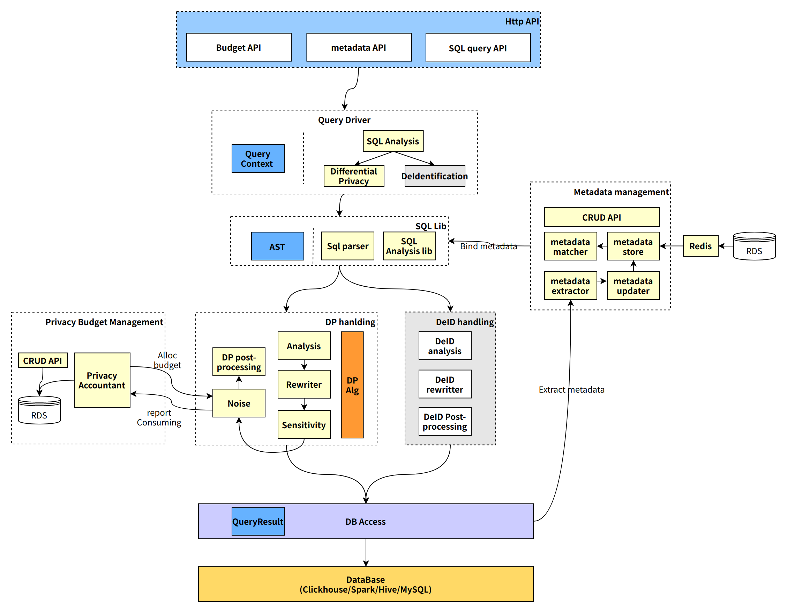
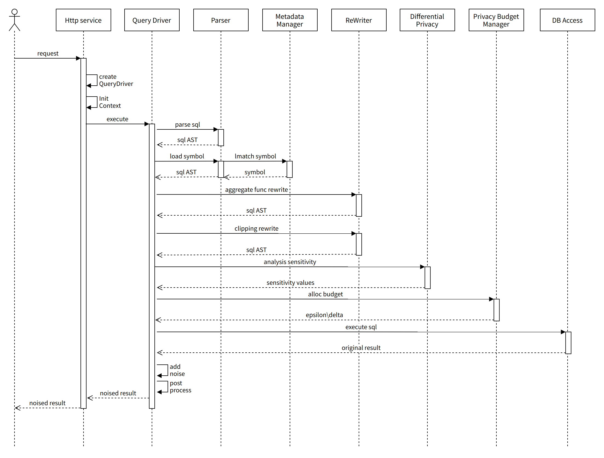

架构概览
=======

模块描述
=======
Http_service
-------------
- 提供Http  API，主要包括 sql query API、metadata management API、privacy budget management API
Query Driver
- QueryDriver 负责驱动其他模块完成 SQL 执行的整体逻辑
- 为每个查询请求单独创建 QueryDriver 对象，QueryContext 对象，独立维护上下文，保持隔离

Parser
------
- 定义统一的 AST 结构，面向差分隐私设计
- 将多种输入方言映射为统一的 AST 结构
- 将 AST 转换为各方言的 SQL 字符串
- AST 支持相关元数据存储，负责将元数据绑定到 AST 节点
- 提供 AST 的遍历、重写 API

Analysis
--------
- 基础信息提取，db_name、table_name、join 信息等
- 提供差分隐私处理策略，能否支持，加噪方式（result based、rewrite based）

Metadata Management
-------------------
- 元数据的持久化存储
- 元数据管理 CURD API
- 元数据高性能查询，多级缓存
- 元数据自动化提取

DP 
----
- 聚合函数加噪处理逻辑
- Clipping 逻辑等
- 敏感度计算 local/smooth/elastic
- 加噪算法
- 加噪结果的可用性计算

Privacy Budget Management
------------------------
- 隐私预算信息的存储和 CRUD
- 维护每个数据表的隐私预算
- 记录每次查询的隐私预算消耗

DBAccess
--------
- 支持各类型的数据源接入
- 提供统一的 query 接口
- 提供统一的查询结果抽象

SQL 处理流程
===========

