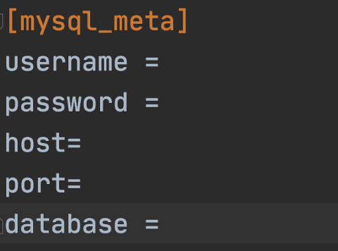
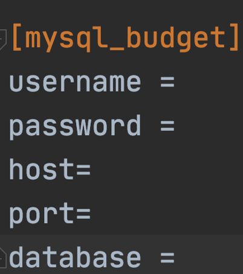

## DPSQL项目部署指南

### 目标


本文将完整介绍如何将DPSQL项目代码搭建部署为可运行服务

### 部署过程

#### 1.服务依赖包安装

进入项目根目录，使用pip install -r requirements.txt安装服务所需完整pip包

#### 2.MetaData存储准备

在使用DPSQL时，需要维护源数据表的MetaData信息，为后续加噪计算敏感度作准备。本项目使用Mysql对相应元数据信息进行存储，因此需要用户提前在自己的Mysql数据库中创建相应的表(涉及4张数据表，表名和表结构按照如下脚本创建)

*1.metadata\_db*
```sql
create table metadata_db
(
    create_time int          null comment 'create time',
    status      tinyint      null comment 'the status of record; 0:deleted； 1:exist',
    id          bigint unsigned auto_increment comment 'primary key' primary key,
    prefix      varchar(200) not null comment 'prefix; could be psm/db_url/ip',
    db_name     varchar(100) not null comment 'database name',
    db_type     varchar(30)  not null comment 'database type'
) comment 'metadata_db' charset = utf8;

create index idx_prefix_dbname on metadata_db (prefix, db_name);
```

*2.metadata\_table*
```sql
create table metadata_table
(
    create_time      int             null comment 'create time',
    status           tinyint         null comment 'the status of record; 0:deleted； 1:exist',
    id               bigint unsigned auto_increment comment 'primary key' primary key,
    table_name       varchar(100)    not null comment 'table name',
    db_id            bigint unsigned not null comment 'the id of metadata_db',
    update_cycle     int             null comment 'the update cycle of metadata',
    last_update_time int             null comment 'last update time'
) comment 'metadata_table' charset = utf8;

create index idx_tablename_dbid on metadata_table (table_name, db_id);
```

*3.metadata\_column*
```sql
create table metadata_column
(
    create_time    int             null comment 'create time',
    status         smallint        null comment 'the status of record; 0:deleted； 1:exist',
    id             bigint unsigned auto_increment comment 'primary key' primary key,
    column_name    varchar(30)     not null comment 'column name',
    type           varchar(50)     not null comment 'column type',
    lower          varchar(30)     null comment 'the lower bound of column value',
    upper          varchar(30)     null comment 'the upper bound of column value',
    max_fre        varchar(10)     null comment 'the maximum frequency of column value',
    table_id       bigint unsigned not null comment 'id of metadata_table',
    clipping_flag  tinyint         null comment 'Whether to enable the clipping operation； 0：disable，1：enable',
    clipping_upper decimal(18, 3)  null comment 'the upper value of clipping',
    clipping_lower decimal(18, 3)  null comment 'the lower value of clipping'
) comment 'metadata_column' charset = utf8;

create index idx_tableid
    on metadata_column (table_id);
```

*4.metadata\_column\_map\_key\_metas*
```sql
create table metadata_column_map_key_metas
(
    create_time    int             null comment 'create time',
    status         smallint        null comment 'the status of record; 0:deleted； 1:exist',
    id             bigint unsigned auto_increment comment 'primary key' primary key,
    key_type       varchar(10)     not null comment 'key type',
    value_type     varchar(10)     not null comment 'value type',
    event_name     varchar(200)    null comment 'event for hive',
    event_lower    varchar(30)     not null comment 'lower bound of event',
    event_upper    varchar(30)     not null comment 'upper bound of event',
    name           varchar(100)    not null comment 'name',
    column_id      bigint unsigned not null comment 'id of metadata_column',
    clipping_flag  tinyint         null comment 'Whether to enable the clipping operation； 0：disable，1：enable',
    clipping_upper decimal(18, 3)  null comment 'the upper value of clipping',
    clipping_lower decimal(18, 3)  null comment 'the lower value of clipping'
) comment 'metadata_column_map_key_metas' charset = utf8;

create index idx_columnid on metadata_column_map_key_metas (column_id);
```

#### 3.隐私预算消耗存储准备

使用DPSQL系统过程，可以记录对表级别的数据查询时的隐私预算消耗。主要通过Mysql进行记录，因此需要用根据以下建表脚本生成相应表名与表结构的数据表。

```sql
CREATE TABLE budget_info (
    prefix VARCHAR(100) NOT NULL,
    db_name VARCHAR(100) NOT NULL,
    table_name VARCHAR(100) NOT NULL,
    total_budget DOUBLE NOT NULL,
    consumed_budget DOUBLE NOT NULL,
    recover_cycle INT NOT NULL DEFAULT 30,
    exhausted_strategy VARCHAR(100) NOT NULL DEFAULT 'reject',
    create_time DATETIME NOT NULL,
    last_update_time DATETIME NOT NULL,
    last_recover_time DATETIME NOT NULL,
    slack DOUBLE NOT NULL DEFAULT 1e-18,
    num_dpcall INT NOT NULL DEFAULT 0,
    sum_eps DOUBLE NOT NULL DEFAULT 0.0,
    sum_del DOUBLE NOT NULL DEFAULT 0.0,
    sum_sq_eps DOUBLE NOT NULL DEFAULT 0.0,
    sum_exp_eps DOUBLE NOT NULL DEFAULT 0.0,
    prod_del DOUBLE NOT NULL DEFAULT 1.0,
    PRIMARY KEY (prefix, db_name, table_name)
);
```

#### 4.数据库连接配置

DPSQL中使用数据库主要有Mysql和Redis，因此需要对这两个数据库连接进行配置。

##### 1.Mysql配置

Mysql配置连接路径主要依赖于用户在部署步骤2和3中MetaData和隐私预算消耗表所在的位置。在项目根目录下utils/config/msql.ini进行配置


(1)在mysql\_meta的section配置步骤2准备的MetaData相关库表所在url



(2)在mysql\_budget的section配置步骤3准备的隐私预算库表所在url




##### 2.redis配置

在项目根目录下utils/config/redis.ini进行配置。

**注**：DPSQL系统中使用redis严格连接模式，因此需要用户**配置redis时设置密码**

#### 5.启动服务

完成前置准备后，在项目根目录下运行bootstrap.sh脚本启动服务


